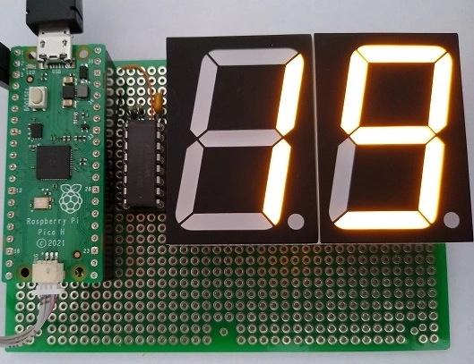
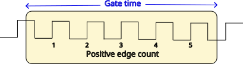
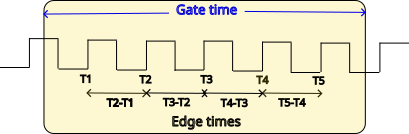

<h1>Accurate frequency measurement on the Pi Pico RP2040 using&nbsp;C</h1>	

	
	
<div>

<br><em>Prototype vehicle speed display</em></div>

<br>
<p>This project describes the creation of the software for a vehicle speedometer. It measures the frequency of a signal that is proportional to speed, but I&#8217;m also using the opportunity to explore two possible techniques for measuring frequency with high accuracy using an RP2040 processor.</p>


<p>If you&#8217;d prefer Python code, see <a href="https://iosoft.blog/picofreq_python">this post</a>.</p>


<h3>Counting transitions using PWM</h3>


<p>Unusually, I&#8217;m going to use the RP2040 PWM (Pulse Width Modulation) peripheral to count the clock pulses. PWM is normally used to generate signals, not measure them,  but the RP2040 peripheral has an unusual feature; it can be use to count pulse-edges, namely the number of low-to-high or high-to-low transitions of an input signal. If we start this counter, and stop after a specific time (which is commonly known as &#8216;gating&#8217; the counter) then we obtain the frequency by dividing the count by the time.</p>


<div>
</div>


<p>The RP2040 documentation uses the unusual term &#8216;slice&#8217; to denote one of the PWM channels, where each slice has 2 &#8216;channels&#8217; (A and B) that are associated with specific I/O pins, as follows:</p>


```
Slice 0 channel A uses GPIO 0, Slice 0 channel B uses GPIO 1
Slice 1 channel A uses GPIO 2, Slice 1 channel B uses GPIO 3
Slice 2 channel A uses GPIO 4, Slice 2 channel B uses GPIO 5
..and so on..
```


<p>When generating PWM signals both channels can be used, but when counting edges we must use the &#8216;B&#8217; channels, so an odd GPIO pin number.</p>


<p>The PWM counter isn&#8217;t difficult to set up, using the standard Pico hardware interface library:</p>


```C++
uint counter_slice;

// Initialise frequency pulse counter
void freq_counter_init(int pin) 
{
    assert(pwm_gpio_to_channel(pin) == PWM_CHAN_B);
    counter_slice = pwm_gpio_to_slice_num(pin);

    gpio_set_function(pin, GPIO_FUNC_PWM);
    pwm_config cfg = pwm_get_default_config();
    pwm_config_set_clkdiv_mode(&cfg, PWM_DIV_B_RISING);
    pwm_config_set_clkdiv(&cfg, 1);
    pwm_init(counter_slice, &cfg, false);
}
```


<p>Starting, stopping and reading the count is quite easy:</p>


```C++
// Get count 
uint16_t freq_counter_read(uint msec)
{
    pwm_set_counter(counter_slice, 0);
    pwm_set_enabled(counter_slice, true);
    sleep_ms(msec);
    pwm_set_enabled(counter_slice, false);    
    return (uint16_t) pwm_get_counter(counter_slice);
}
```


<p>This code works fine, with a few limitations:</p>


<ol>
<li>The sleep_msec() call isn&#8217;t very accurate, its timing will depend on other activities the RP2040 is performing (such as USB interrupts).</li>


<li>During the sleep_ms() call the CPU is just wasting time, doing nothing; if we want to do something else (such as scanning a button input) then we&#8217;ll have to use a timer interrupt for that, which will further reduce the accuracy of the sleep timing.</li>


<li>The count is a 16-bit number, so we must choose a gate-time that ensures the counter won&#8217;t overflow.</li>
</ol>


<p>To fix points 1 &amp; 2 we need the gating timer to be implemented in hardware, and we can use another PWM &#8216;slice&#8217; for this purpose; it is basically acting as an up-counter fed from a known clock, and when it times out, we halt the counter PWM, so its value is fixed.</p>


<p>To achieve good accuracy, there should also be a hardware link between the timeout of the timer PWM and the stopping of the counter PWM, so it won&#8217;t matter what code the CPU is executing at the time. Fortunately the timer PWM can trigger a DMA (Direct Memory Access) cycle when it times out, and we can use this cycle to update the counter PWM control register, stopping the counter. This means that once the two PWM slices are started (counter &amp; timer) no more CPU intervention is required, until the data capture is finished.</p>


<p>Initialising the gate time &amp; DMA is a little more complicated:</p>


```C++
#define TIMER_PRESCALE      250     // 8-bit value
#define TIMER_WRAP          125000  // 17-bit value
#define SAMPLE_FREQ         (125000000 / (TIMER_PRESCALE*TIMER_WRAP))

uint gate_slice, gate_dma_chan, timer_dma_dreq, csr_stopval;

// Initialise gate timer, and DMA to control the counter
void gate_timer_init(int pin)
{
    gate_slice = pwm_gpio_to_slice_num(pin);
    io_rw_32 *counter_slice_csr = &amp;pwm_hw-&gt;slice&#91;counter_slice].csr;
    
    gpio_set_function(pin, GPIO_FUNC_PWM);
    pwm_set_clkdiv_int_frac(gate_slice, TIMER_PRESCALE, 0);
    pwm_set_wrap(gate_slice, TIMER_WRAP/2 - 1);
    pwm_set_chan_level(gate_slice, PWM_CHAN_B, TIMER_WRAP/4);
    pwm_set_phase_correct(gate_slice, true);
        
    gate_dma_chan = dma_claim_unused_channel(true);
    dma_channel_config cfg = dma_channel_get_default_config(gate_dma_chan);
    channel_config_set_transfer_data_size(&amp;cfg, DMA_SIZE_32);
    channel_config_set_read_increment(&amp;cfg, false);
    channel_config_set_dreq(&amp;cfg, pwm_get_dreq(gate_slice));
    csr_stopval = *counter_slice_csr;
    dma_channel_configure(gate_dma_chan, &amp;cfg, counter_slice_csr, &amp;csr_stopval, 1, false);
    pwm_set_enabled(gate_slice, true);
}
```


<p>The PWM wrap settings deserve some explanation; since the hardware register is 16 bits, the obvious choice is to set the timer wrap value to 65536 or less, but this means the longest gate-time is 65536 * 256 / 125 MHz = 134 msec. However, by selecting &#8216;phase correct&#8217; mode, the PWM device counts up to the wrap value, then back down again, before triggering the DMA. So the wrap value effectively becomes 17 bits wide, and we can set a gate time of 250 msec, as in the code above.</p>


<p>To run a capture cycle, it is only necessary to give the DMA controller the address of the register to be modified (the counter PWM &#8216;csr&#8217; register) and start both PWM slices simultaneously.</p>


```C++
// Start pulse counter
void counter_start(void)
{
    dma_channel_transfer_from_buffer_now(timer_dma_chan, &amp;csr_stopval, 1);
    pwm_set_counter(counter_slice, 0);
    pwm_set_counter(gate_slice, 0);
    pwm_set_mask_enabled((1 &lt;&lt; counter_slice) | (1 &lt;&lt; gate_slice));
}
```


<p>To get read the counter value, we need to wait until the DMA cycle is complete, then stop the timer and access the count register.</p>


```C++
// Get pulse count
int counter_value(void)
{
    while (dma_channel_is_busy(gate_dma_chan)) ;
    pwm_set_enabled(gate_slice, false);    
    return((uint16_t)pwm_get_counter(counter_slice));
}
```


<p>There is still the problem of the counter potentially overflowing if there is a high-frequency input; this could be solved using a PWM overflow interrupt, but personally I prefer to poll the count value to check for overflow, for example:</p>


```C++
uint counter_lastval, counter_overflow;

// Check for overflow, and check if capture complete
bool counter_value_ready(void)
{
    uint n = pwm_get_counter(counter_slice);
    
    if (n &lt; counter_lastval)
        counter_overflow++;
    counter_lastval = n;
    return (!dma_channel_is_busy(timer_dma_chan));
}
```


<p>A capture cycle that is protected against counter overflow could now look like:</p>


```C++
counter_start();
while (!counter_value_ready())
{
    // Insert code here to be executed while waiting for value
}
printf("%u Hz\n", frequency_value());
```


<h3>Reciprocal measurement</h3>


<p>The &#8216;count-the-edges&#8217; technique described above works well for reasonably fast signals (e.g. 1 kHz and above), but at lower frequencies it is quite inaccurate, so an alternative technique is used, which is known as &#8216;time-interval&#8217; or &#8216;reciprocal&#8217; measurement.</p>


<p>Instead of counting the number of transitions in a given time, the new technique measures the time between the transitions, for one or more cycles; the inverse of this time is the frequency.</p>


<div>
</div>


<p>We have already seen how the RP2040 PWM peripheral can be used to count pulses and generate DMA requests; if the &#8216;wrap&#8217; value is set to zero, then the PWM will generate a DMA request for every positive-going transition of the input signal. This DMA cycle can be used to copy the 32-bit microsecond value from a timer register into an array. So we end up with an array of microsecond timing values, and the inverse of these is the frequency.</p>


<p>The modifications to the previously-described code aren&#8217;t substantial, we just need to modify the counter &#8216;wrap&#8217; value, and set up the DMA transfers of the timing values.</p>


```C++
#define NUM_EDGE_TIMES      11
#define EDGE_WAIT_USEC      2000001
uint edge_times&#91;NUM_EDGE_TIMES]; 

// Initialise DMA to store the edge times
void edge_timer_init(void) 
{
    timer_dma_chan = dma_claim_unused_channel(true);
    dma_channel_config cfg = dma_channel_get_default_config(timer_dma_chan);
    channel_config_set_transfer_data_size(&amp;cfg, DMA_SIZE_32);
    channel_config_set_read_increment(&amp;cfg, false);
    channel_config_set_write_increment(&amp;cfg, true);
    channel_config_set_dreq(&amp;cfg, pwm_get_dreq(counter_slice));
    dma_channel_configure(timer_dma_chan, &amp;cfg, edge_times, &amp;timer_hw-&gt;timerawl, NUM_EDGE_TIMES, false);
    pwm_set_wrap(counter_slice, 0);
}
```


<p>The first 2 definitions give the number of cycles to be captured, and the length of time to wait for the edges to arrive. These may be tuned as required; a slow signal will require a long capture time, for example a 1 Hz signal needs at least 2 seconds to be sure of capturing 2 edges. Conversely, achieving high accuracy on a fast signal will require a large array, since the result is calculated from the average of all the values.</p>


```C++
// Get average of the edge times
int edge_timer_value(void)
{
    uint i=1, n;
    int total=0;

    dma_channel_abort(timer_dma_chan);
    pwm_set_enabled(counter_slice, false);    
    while (i&lt;NUM_EDGE_TIMES &amp;&amp; edge_times&#91;i])
    {
        n = edge_times&#91;i] - edge_times&#91;i-1];
        total += n;
        i++;
    }
    return(i&gt;1 ? total / (i - 1) : 0);
}

// Get frequency value from edge timer
float edge_freq_value(void)
{
    int val = edge_timer_value();
    return(val ? 1e6 / val : 0);
}
```


<p>The main loop now looks like:</p>


```C++
edge_timer_init();
while (true) 
{
    memset(edge_times, 0, sizeof(edge_times));
    edge_timer_start();
    sleep_ms(EDGE_WAIT_USEC / 1000);
    printf("Frequency %8.6f Hz\n", edge_freq_value());
}
```


<p>Since DMA has been used to capture the data, the sleep timing is completely non-critical; it can be increased to accommodate slower input signals, or reduced to provide a quicker answer with faster signals.</p>


<p>However, as mentioned above, the use of &#8216;sleep&#8217; does render the CPU unresponsive for that duration, which is a problem if you want it to do other things, e.g. scan for button-presses. A simple way of fixing this issue (without resorting to interrupts) is to create a polled timer, that keeps track of the elapsed time, and returns a &#8216;true&#8217; value when there is a timeout.</p>


```C++
// Return non-zero if timeout
bool ustimeout(uint *tickp, uint usec)
{
    uint t = time_us_32(), dt = t - *tickp;

    if (usec == 0 || dt &gt;= usec)
    {
        *tickp = t;
        return (1);
    }
    return (0);
}
```


<p>Before using this timer, we call the function with a pointer to a &#8216;uint&#8217; variable, and a zero microsecond value; this initialises the variable with the current time. Thereafter, we just call the function with the desired timeout value, and it will return &#8216;true&#8217; on timeout. The main loop becomes:</p>


```C++
uint edge_ticks;

while (true) 
{
    memset(edge_times, 0, sizeof(edge_times));
    edge_timer_start();
    ustimeout(&edge_ticks, 0);
    while (!ustimeout(&edge_ticks, EDGE_WAIT_USEC))
    {
        // Insert code here to be executed while waiting for value
    }
    printf("Frequency %5.3f Hz\n", edge_freq_value());
```


<p>This code can be used to measure very low frequencies; for example, with the gate time of over 2 seconds, it is possible to measure the 1 PPS (1 Pulse Per Second) signal from a GPS module, to within 6 decimal places. This is useful for checking the accuracy of the Pico microsecond timer, since the PPS signal is locked to the very accurate satellite clocks.</p>


<h3>Running the code</h3>


<p>The source code is available <a href="https://github.com/jbentham/picofreq">on Github here</a>. There is a single C source file (picofreq.c), with a definition at the top to choose between edge-counter and edge-timer (reciprocal) measurements, then some definitions for the two methods:</p>


```C++
// Set zero to use edge-counter, 1 to use edge-timer
#define USE_EDGE_TIMER      0

// Definitions for edge-counter
#define TIMER_PRESCALE      250     // 8-bit value
#define TIMER_WRAP          125000  // 17-bit value
#define SAMPLE_FREQ         (125000000 / (TIMER_PRESCALE * TIMER_WRAP))

// Definitions for edge-timer
#define NUM_EDGE_TIMES      11
#define EDGE_WAIT_USEC      200001
```


<p>In edge-counter mode, you need to select values that give you the required gate time, bearing in mind the prescaler value is 8 bits, and the wrap value is 17 bits. The settings above give a gate-time of 250 * 12500 / 125000000 = 0.25 seconds, which is close to the maximum.</p>


<p>For the edge-timer, the definitions are the number of edges to captured, and the overall time to wait. In the example above, the frequency is calculated using the average of 10 time-difference values, with a waiting time of 0.2 seconds. To gain maximum accuracy from fast signals, it will be necessary to increase the number of edges; conversely, if you want to measure a slow signal such as the 1 Hz output from a GPS, then the waiting-time needs to be increased to over 2 seconds.</p>


<p>In either mode, the program prints the frequency on the default serial console (115k baud on GPIO pin 0), and toggles the Pico on-board LED. If you are using the Pico-W wireless variant then the LED is driven by the CYW43439 WiFi chip, and it is much more complex to control, so if you want to retain this feature, an external LED may be used on any convenient pin number.</p>


<p>The GPIO pin definitions are:</p>


```C++
#define FREQ_IN_PIN         7
#define GATE_TIMER_PIN      0
```


<p>The frequency input can be any odd-numbered GPIO pin, as discussed above. The gate timer pin definition is just a convenient way of specifying a PWM slice, so the above definition selects slice 0 channel A. Since GPIO pin 0 is defined as a serial output, there is no clash between the serial &amp; PWM signals; the PWM output signal is discarded.</p>


<p>To build and run the code, I have included a minimal CMakeLists.txt, the only addition being the enabling of all warnings:</p>


```C++
cmake_minimum_required(VERSION 3.12)
include(pico_sdk_import.cmake)
project(picofreq C CXX ASM)
pico_sdk_init()
add_compile_options(-Wall)
add_executable(picofreq picofreq.c)
target_link_libraries(picofreq pico_stdlib hardware_pwm hardware_dma)
pico_add_extra_outputs(picofreq)
```


<p>This generates a uf2 file in the &#8216;build&#8217; directory that can be programmed into the Pico using the normal method (holding the pushbutton down while powering up, then drag-and-drop using the USB filesystem) but personally I find it much more convenient to use the the Pico debug probe, and in case you are using the Windows VS Code front-end, I have included the standard launch.json and settings.json files in a .vscode subdirectory, since I&#8217;ve found these to be essential for using VS Code. To download &amp; debug the code, just hit ctrl-shift-D to bring up the debug window, then F5. If you are using and alternative debug adaptor, it will probably be necessary to modify launch.json, but the variety of options are too complex to be described here.</p>


<p><em>Copyright (c) Jeremy P Bentham 2023. Please credit this blog if you use the information or software in it</em>.</p>
