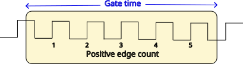
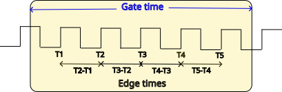

<h1>Accurate frequency &amp; timing measurement on the Pi Pico RP2040 using&nbsp;Python</h1>


<div>
</div>


<p>In a <a href="https://iosoft.blog/picofreq">previous post</a>, I looked at ways of measuring frequency accurately using an RP2040 CPU programmed in C. In this project, I have re-coded those functions in MicroPython, and provided a few enhancements.</p>


<p>I use Direct Memory Access (DMA) to minimise the CPU workload, and avoid the need for interrupts, but this raises a problem: when programming in C, there is a substantial Application Programming Interface (API) that allows everything on the RP2040 chip to be configured using simple function calls. However, MicroPython aims to be more-or-less compatible with a wide range of CPUs, so not much CPU-specific code has been included. This means that we have to do some low-level programming if we want to use DMA, or the more obscure functions of the RP2040 Pulse Width Modulation (PWM) peripheral.</p>


<p>My first attempt at ADC and DMA low-level programming used MicroPython &#8216;uctypes&#8217; to create a model of the peripherals, and if you are interested in the nuts-and-bolts of this method, I suggest you browse the post <a href="https://iosoft.blog/pico-adc-dma/">here</a>.</p>


<p>This approach produced excellent results, but wasn&#8217;t very &#8216;pythonic&#8217;, so I&#8217;ve encapsulated common API functions in Python classes; when choosing function names, I&#8217;ve copied those in the C API when possible. So for example, setting the PWM peripheral in C is:</p>


```C++
#define PWM_GPIO_PIN 3
uint slice = pwm_gpio_to_slice_num(PWM_GPIO_PIN);
pwm_config cfg = pwm_get_default_config();
pwm_config_set_clkdiv_mode(&cfg, PWM_DIV_B_RISING);
// ..and any other settings, then..
pwm_init(slice, &cfg, false);
```


<p>In MicroPython this is done by instantiating a device from the PWM class:</p>


```python
import pico_devices as devs
PWM_GPIO_PIN = 3
pwm = devs.PWM(PWM_GPIO_PIN)
pwm.set_clkdiv_mode(devs.PWM_DIV_B_RISING)
# ..and any other settings..
```


<p>Not only are the function call names very similar between C and Python, but also the underlying code is similar; for example, the set_clkdiv function is defined as:</p>


```python
class PWM:
    def set_clkdiv_mode(self, mode):
        self.slice.CSR.DIVMODE = mode
```


<p>where &#8216;slice&#8217; is the (somewhat unusual) name for a PWM channel, CSR is the Control and Status Register, and DIVMODE is a 2-bit field within that register. If you want to learn more about the internal structure of the PWM peripheral, I suggest you take a look at the  <a href="https://iosoft.blog/picofreq">C language post</a>.</p>


<p>The Python classes have been kept very &#8216;lean&#8217;, with no error-checking of the parameters; when time permits, I intend to create a sub-class that provides comprehensive parameter-checking .</p>


<h2>Test signal</h2>


<p>We need a waveform for the tests, which the RP2040 PWM peripherals can easily provide. The following code generates a 100 kHz square wave on GPIO pin 4:</p>


```python
PWM_OUT_PIN = 4             # GPIO pin for output
PWM_DIV = 125               # 125e6 / 125 = 1 MHz
PWM_WRAP = 9                # 1 MHz / (9 + 1) = 100 kHz
PWM_LEVEL = (PWM_WRAP+1)//2 # 50% PWM

# Start a PWM output
def pwm_out(pin, div, level, wrap): 
    devs.gpio_set_function(pin, devs.GPIO_FUNC_PWM)
    pwm = devs.PWM(pin)
    pwm.set_clkdiv_int_frac(div, 0)
    pwm.set_wrap(wrap)
    pwm.set_chan_level(pwm.gpio_to_channel(pin), level)
    pwm.set_enabled(1)
    return pwm

test_signal = pwm_out(PWM_OUT_PIN, PWM_DIV, PWM_LEVEL, PWM_WRAP)
```


<p>The choice of GPIO pin number is quite arbitrary, you just need to be aware when programming PWM that there are are 16 channels (technically 8 slices, each with 2 channels) mapped onto 32 pins, so if I&#8217;m using GPIO pin 4 for this signal, I can&#8217;t use PWM on GPIO 20. However, that pin is still available for any other purpose, so the limitation usually isn&#8217;t a problem.</p>


<h2>16-bit counter</h2>


<div>
</div>


<p>The RP2040 PWM peripheral can also act as a pulse counter, and by counting the number of edges in a given time, we can establish the frequency. This pulse input capability is only available on odd GPIO pin numbers (i.e. channel B of a PWM &#8216;slice&#8217;).</p>


<p>The code is quite simple; it is only necessary to set the mode, and the frequency divisor:</p>


```python
# Initialise PWM as a pulse counter (gpio must be odd number)
def pulse_counter_init(pin, rising=True):
    devs.gpio_set_function(pin, devs.GPIO_FUNC_PWM)
    ctr = devs.PWM(pin)
    ctr.set_clkdiv_mode(devs.PWM_DIV_B_RISING if rising else devs.PWM_DIV_B_FALLING)
    ctr.set_clkdiv(1)
    return ctr
```


<p>Now we can make a simple frequency meter, by clearing the count to zero, then enabling the counter for a specific period of time:</p>


```python
# Enable or disable pulse counter
def pulse_counter_enable(ctr, en):
    if en:
        ctr.set_ctr(0)
    ctr.set_enabled(en)

# Get value of pulse counter
def pulse_counter_value(ctr):
    return ctr.get_counter()

pulse_counter_enable(counter, True)
time.sleep(0.1)
pulse_counter_enable(counter, False)
val = pulse_counter_value(counter)
print("Sleep 0.1s, count %u" % val)
```


<p>The count-value for a 100 kHz signal and a 100 millisecond sleep is theoretically 10000, but is actually around 10015, due to the time-delays associated with the Python instructions. I&#8217;ll be describing ways to eliminate these delays later on in this post.</p>


<h2>32-bit counter</h2>


<p>Unfortunately the PWM peripheral has only a 16-bit counter, which can be too short for high-frequency signals or long sample-times. In the C code I polled the count value, to count the number of times it rolled over past 65535, then add on that number to the final result.</p>


<p>An alternative method is to take advantage of the fact that the DMA controller has a 32-bit down-counter that decrements every time a DMA cycle is completed. So we just need to set the DMA count to a large number, and set the PWM peripheral to trigger a DMA cycle on every rising or falling edge of the input signal.</p>


<p>This prompts the question &#8220;what data should the DMA transfer?&#8221; and the answer is &#8220;anything: it doesn&#8217;t matter&#8221;, but we still have to be careful to ensure the transfers don&#8217;t over-write some random area in memory. We need to very carefully specify the DMA source &amp; destination addresses, using the binary &#8216;array&#8217; data type, which occupies a fixed area of memory, without all the complexities of a Python &#8216;object&#8217;. The syntax to create the array is somewhat unusual; rather than just specifying a size, we have to provide the initial data using an iterator. The pico_devices library provides a helper function to simplify the process:</p>


```python
# Create 32-bit array (to receive DMA data)
def array32(size):
    return array.array('I', (0 for _ in range(size)))
```


<p>To use this array with DMA, we have to get its address in memory, using &#8216;uctypes.addressof&#8217;:</p>


```python
# Get address of variable (for DMA)
def addressof(var):
    return uctypes.addressof(var)
```


<p>Armed with these functions, we can initialise the DMA controller:</p>


```python
ext_data = devs.array32(1)  # Dummy array for extended counter

# Use DMA to extend pulse counter to 32 bits
def pulse_counter_ext_init(ctr):
    ctr.set_enabled(False)
    ctr.set_wrap(0)
    ctr.set_ctr(0)
    ctr_dma = devs.DMA()
    ctr_dma.set_transfer_data_size(devs.DMA_SIZE_8)
    ctr_dma.set_read_increment(False)
    ctr_dma.set_write_increment(False)
    ctr_dma.set_read_addr(devs.addressof(ext_data))
    ctr_dma.set_write_addr(devs.addressof(ext_data))
    ctr_dma.set_dreq(ctr.get_dreq())
    ctr.set_enabled(True)
    return ctr_dma
```


<p>We&#8217;re modifying the PWM 16-bit counter to wrap around to zero on every input edge, and initialising its starting value to zero, which is essential. Then a DMA channel is instantiated, and configured to copy 8 bits from the data array back to the data array.</p>


<p>It is important to note that enabling the DMA counter does not necessarily start the transfer from scratch; if a transfer has already started, the controller will resume counting where it left off. So it is necessary to clear out any existing transfer, before stating a new one:</p>


```python
# Start the extended pulse counter
def pulse_counter_ext_start(ctr_dma):
    ctr_dma.abort()
    ctr_dma.set_trans_count(0xffffffff, True)
 
# Stop the extended pulse counter
def pulse_counter_ext_stop(ctr_dma):
    ctr_dma.set_enable(False)
 
# Return value from extended pulse counter
def pulse_counter_ext_value(ctr_dma):
    return 0xffffffff - ctr_dma.get_trans_count()
```


<p>Using the extended pulse counter is similar to the 16-bit counter, we just need to remember the limitation that if the 32-bit value is exceeded, the counter will stop, and not wrap around.</p>


```python
counter_dma = pulse_counter_ext_init(counter)
pulse_counter_ext_start(counter_dma)
time.sleep(1.0)
val = pulse_counter_ext_value(counter_dma)
pulse_counter_ext_stop(counter_dma)
print("Sleep 1.0s, ext count %u" % val)
```


<p>A typical response is:</p>


```
Sleep 1.0s, ext count 100011
```


<p>This shows that the count is not limited to 16 bits.</p>


<h2>Gating a counter</h2>


<p>To accurately count pulses with a specific time-frame, it is necessary for the timing to be accurate, and as we have seen, the &#8216;sleep&#8217; function introduces a significant error. To eliminate this, we need a hardware mechanism whereby a timer directly enables and disables the counter (a process called &#8216;gating&#8217;) without requiring any intervention from the CPU.</p>


<p>This involves programming another PWM channel to act as a timer, then when the time has expired, using DMA to modify the counter&#8217;s register to stop counting. The default PWM clock is 125 MHz, the prescaler is 8 bits, and the counter register is 16 bits, effectively 17 bits if we engage &#8216;phase correct&#8217; mode. So the slowest gate frequency is 125e6 / (256 * 65536 * 2) = 3.725 Hz, a gate-time of 0.268 seconds; I&#8217;ve opted for 0.25 seconds.</p>


```python
GATE_TIMER_PIN = 0          # Used to define PWM slice
GATE_PRESCALE = 250         # 125e6 / 250 = 500 kHz
GATE_WRAP = 125000          # 500 kHz / 125000 = 4 Hz (250 ms)

# Initialise PWM as a gate timer
def gate_timer_init(pin):
    pwm = devs.PWM(pin)
    pwm.set_clkdiv_int_frac(GATE_PRESCALE, 0)
    pwm.set_wrap(int(GATE_WRAP/2 - 1))
    pwm.set_chan_level(pwm.gpio_to_channel(pin), int(GATE_WRAP/4))
    pwm.set_phase_correct(True)
    return pwm
```


<p>This code uses GPIO pin 0 to identify which PWM &#8216;slice&#8217; is being used. Since we aren&#8217;t enabling PWM I/O on that pin, it can still be used for any other function, such as serial output.</p>


<p>We need to trigger a DMA cycle when the gate PWM times out; that cycle will be used to disable the counter PWM. So when initialising the DMA channel, we need to capture the non-enabled state, that will be written into the counter CSR register; this is only one 32-bit value, but I&#8217;m using a fixed array for that value, since DMA can&#8217;t handle the complexities of Python object storage.</p>


```python
gate_data = devs.array32(1)

# Initialise gate timer DMA
def gate_dma_init(ctr, gate):
    dma = devs.DMA()
    dma.set_transfer_data_size(devs.DMA_SIZE_32)
    dma.set_read_increment(False)
    dma.set_write_increment(False)
    dma.set_dreq(gate.get_dreq())
    gate_data&#91;0] = ctr.slice.CSR_REG
    dma.set_read_addr(devs.addressof(gate_data))
    dma.set_write_addr(ctr.get_csr_address())
    return dma
```


<p>To start the frequency measurement, it is necessary to set the DMA count (since this is reset by a DMA cycle), enable DMA, then enable the gate &amp; counter PWM devices simultaneously. </p>


```python
# Start frequency measurment using gate
def freq_gate_start(ctr, gate, dma):
    ctr.set_ctr(0)
    gate.set_ctr(0)
    dma.set_trans_count(1, True)
    ctr.set_enables((1&lt;&lt;ctr.slice_num) | (1&lt;&lt;gate.slice_num), True)
```


<p>If all is well, the test signal frequency should be reported correctly on the console:</p>


```
Gate 250.0 ms, count 25000, freq 100.0 kHz
```


<h2>Edge timer</h2>


<div>
</figure></div>


<p>An alternative method for measuring frequency is to measure the times between the rising or falling edges, producing values that are the reciprocal of the frequency. This is particularly useful when dealing with slow signals, or if you want to implement a method to eliminate &#8216;rogue&#8217; pulses, since you get one measurement for each cycle of the input signal, so could reject pulses that are outside the expected frequency range.</p>


<p>By now, you won&#8217;t be surprised to learn that I use DMA to capture the time-value for each edge; there is a convenient 32-bit microsecond-value that can be copied into a suitably-sized array on edge positive or negative edge; the sole function of the PWM peripheral is to detect the edge, and trigger a DMA cycle.</p>


<p>We&#8217;ll be generating a test signal as before, but this time it is 10 Hz:</p>


```python
PWM_DIV = 250               # 125e6 / 125 = 500 kHz
PWM_WRAP = 50000 - 1        # 500 kHz / 50000 = 10 Hz
```


<p>The PWM peripheral initialisation is similar to previous functions:</p>


```python
# Initialise PWM as a timer (gpio must be odd number)
def timer_init(pin, rising=True):
    devs.gpio_set_function(pin, devs.GPIO_FUNC_PWM)
    pwm = devs.PWM(pin)
    pwm.set_clkdiv_mode(devs.PWM_DIV_B_RISING if rising else devs.PWM_DIV_B_FALLING)
    pwm.set_clkdiv(1)
    pwm.set_wrap(0);
    return pwm
```


<p>The DMA controller is also similar, but the destination is set to auto-increment with every transfer:</p>


```python
# Initialise timer DMA
def timer_dma_init(timer):
    dma = devs.DMA()
    dma.set_transfer_data_size(devs.DMA_SIZE_32)
    dma.set_read_increment(False)
    dma.set_write_increment(True)
    dma.set_dreq(timer.get_dreq())
    dma.set_read_addr(devs.TIMER_RAWL_ADDR)
    return dma
```


<p>Starting the DMA is a bit different; firstly we need to use the &#8216;abort&#8217; command to stop any previous transfer that might still be in progress. If we didn&#8217;t do that, and just enabled DMA, the transfer would resume where it left off &#8211; the new settings would be ignored. Secondly we need to set both the transfer count and the destination address, since these will have been changed by a previous transfer.</p>


```python
# Start frequency measurment using gate
def timer_start(timer, dma):
    timer.set_ctr(0)
    timer.set_enabled(True)
    dma.abort()
    dma.set_write_addr(devs.addressof(time_data))
    dma.set_trans_count(NTIMES, True)
```


<p>The main program needs to perform some simple maths to derive the frequency, guarding against the possibility that there may be insufficient time-values (1 or less):</p>


```python
NTIMES = 9                       # Number of time samples
time_data = devs.array32(NTIMES) # Time data

timer_pwm = timer_init(PWM_IN_PIN)
timer_dma = timer_dma_init(timer_pwm)
    
timer_start(timer_pwm, timer_dma)
time.sleep(1.0)
timer_stop(timer_pwm)
    
count = NTIMES - timer_dma.get_trans_count()
data = time_data&#91;0:count]
diffs = &#91;data&#91;n]-data&#91;n-1] for n in range(1, len(data))]
total = sum(diffs)
freq = (1e6 * len(diffs) / total) if total else 0
print("%u samples, total %u us, freq %3.1f Hz" % (count, total, freq))
```


<p>The frequency of the test signal should be displayed on the console:</p>


```
9 samples, total 800000 us, freq 10.0 Hz
```


<h2>Running the code</h2>


<p>The source files are available on  <a href="https://github.com/jbentham/picofreq">Github here</a>.&nbsp;It is necessary to load the library file &#8216;pico_devices.py&#8217; onto the target system; if you are using the Thonny editor, this is done by right-clicking the filename, and selecting &#8216;Upload to /&#8217;. You can then run one of the program files to measure frequency:</p>


<ul>
<li>pico_counter.py: use simple pulse counting and sleep timing</li>


<li>pico_freq.py: use DMA to accurately gate the pulse counter</li>


<li>pico_timer.py: use time-interval (reciprocal) measurement</li>
</ul>


<p>Don&#8217;t forget to link GPIO pin 4 (the test signal output) to pin 3 (the measurement input) for these tests.</p>


<p><em>Copyright (c) Jeremy P Bentham 2023. Please credit this blog if you use the information or software in it.</em></p>


